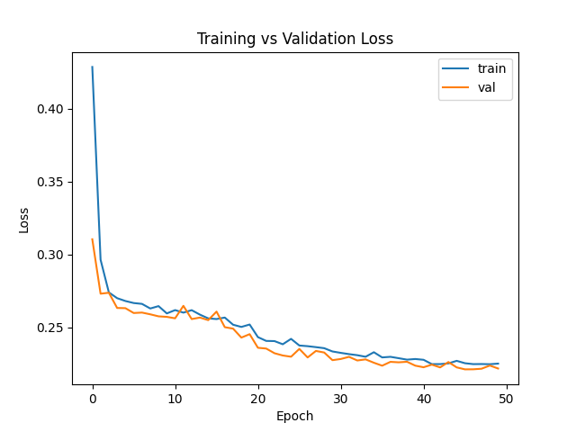
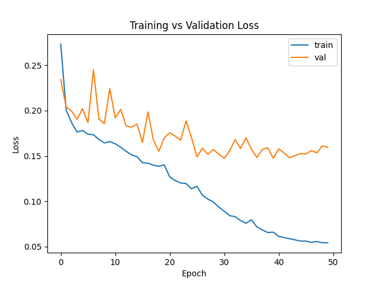
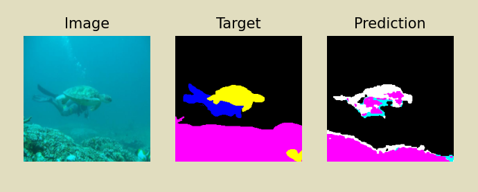
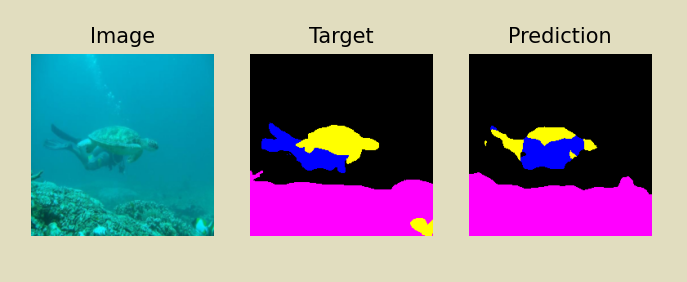

# SUIM - Semantic Segmentation of Underwater Imagery

## Overview

This repository, presents a comprehensive study and implementation of semantic segmentation techniques using the PyTorch framework. The primary focus of this project was to independently design and implement the U-Net architecture and compare its performance against the pre-trained Deeplabv3_resnet50.

## Dataset

The SUIM dataset contains over 1500 images with pixel annotations for eight object categories: fish (vertebrates), reefs (invertebrates), aquatic plants, wrecks/ruins, human divers, robots, and sea-floor. The images have been rigorously collected during oceanic explorations and human-robot collaborative experiments, and annotated by human participants.
[Dataset page](https://irvlab.cs.umn.edu/resources/suim-dataset)

## Installation

Download the dataset from the above link and put it into /data directory .
```bash
pip install pip -U
pip install -r requirements.txt
```

## Usage

```bash
python ./main.py -m "<model_name>"
```

## Architectures

* __Custom U-Net__ - I implemented our own U-Net network from scratch based on paper "U-Net: Convolutional Networks for Biomedical Image Segmentation" [link](https://arxiv.org/abs/1505.04597). The model has two components: an encoder and a decoder, and skip connections between the encoder and decoder layers. The whole is assembled in the “UNet” class. The numbers of channels for all layers in encoder and decoder are customizable.

* Deeplabv3-resnet50 - For the comparison I also used the DeepLabV3 which is implemented as a part of PyTorch's segmentation package [link](https://pytorch.org/vision/main/models/deeplabv3.html). This architecture uses atrous convolution to increase the receptive field of neurons in convolutional layers without shrinking the spatial resolution of the next layer. This is done by adding a stride to the sampling of the input layer and treating entries in between the strides as zeroes. This modification is applied to the ResNet architecture by duplicating the last block with spatial resolution equal to 16 and applying atrous convolution with a varying stride. This technique helps capture features at different scales.
[Explanation](https://developers.arcgis.com/python/guide/how-deeplabv3-works/)

## Results

| Model | BCE loss |
| --- | --- |
| U-Net | 0.2377 |
| ResNet50 | 0.1397 |

## Training
### U-Net &emsp; &emsp; &emsp; &emsp; &emsp; &emsp; &emsp; &emsp; &emsp; &emsp; &emsp; &emsp; ResNet50
<p float="left">
  
  
</p>

## Predictions
### U-Net
<p float="left">
  
</p>

### ResNet50
<p float="left">
  
</p>

## License
See the LICENSE file for license rights and limitations (MIT).
